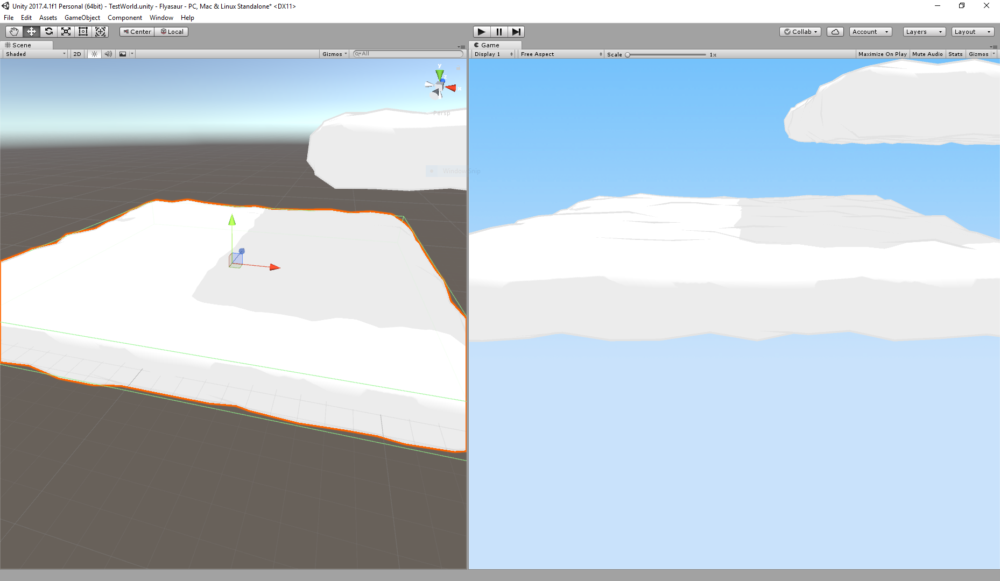
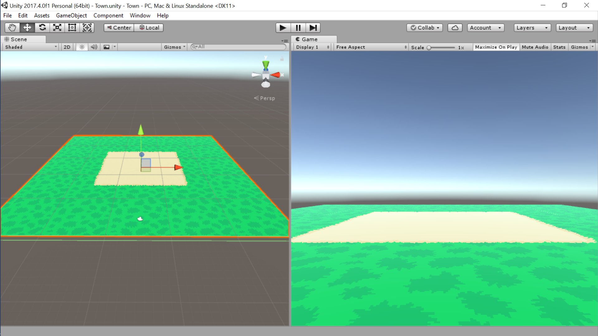

# Unity Scripts

Unity scripts I've written for practice or fun. Feel free to use anything here however you'd like.

### [Procedural Toon Cloud](ProceduralToonCloud/)

A script for procedurally generated clouds for a 3D platformer I've been prototyping. It generates a cube and applies [Catlike Coding](http://catlikecoding.com/unity/tutorials/rounded-cube/)'s method for rounding the cube, but I use a random scalar for the roundness factor to make it bumpy. This produces a low poly cloud, but when paired with a outlined cel shader, it gives the cloud the cartoon-like look I was going for.

### [TileMap 3D](TileMap3D/)

A quick tilemap script I wrote to test the look of pixel art in 3D and to practice procedural mesh generation. The texture I created for the sample is included.

